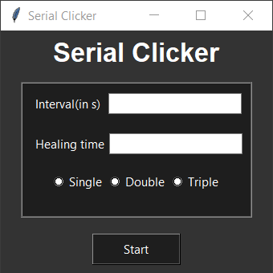

*  # Serial clicker
    ## Description
    This piece of code can make someone laugh and the other cry at the same time!
     
    
     
    What it does?
    * Lets the user input two values - *interval* and *healingtime* and the *type of click*
    * Performs that type of click for *'interval'* time with a gap of *'healingtime'* randomly anywhere on your desktop
    * For example, if *click=Double*, *interval=2*, *healingtime=4*, then the code will repeatedly perform double clicks for a time of 2s, pause for 4s and then again clicks for 2s. This process is continued until the process is force stopped(a warm boot will work).
    
    ### How to deploy?
    * One time fun:
        * Open the executable on victim's system
        OR
        * Open the python file if the victim has all required libraries installed
    * The show must go on:
        * Put the executable in the startup folder of windows
        OR
        * Put the python file in the startup folder of windows if the victim has all required libraries installed
     
    The executable for windows can be located in the dist/ directory
        
    ## Technologies used:
      - python3
      - tkinter library
      -  pyautogui library

    ## How to install requirements:
        pip install tkinter
        pip install pyautogui
        
    ## Create your own executable
        pip install pyinstaller
        cd script_folder
        pyinstaller script.py                       //for executable with dependencies
        pyinstaller --onefile script.py             //standalone executable file with terminal
        pyinstaller --onefile -w script.py          //standalone executable without terminal
        
    **The executable will be located in the script_folder/dist directory**
     
    *To create a setup use NSIS open source software*
     
    *To compress the exe significantly use strip.exe then UPX*
